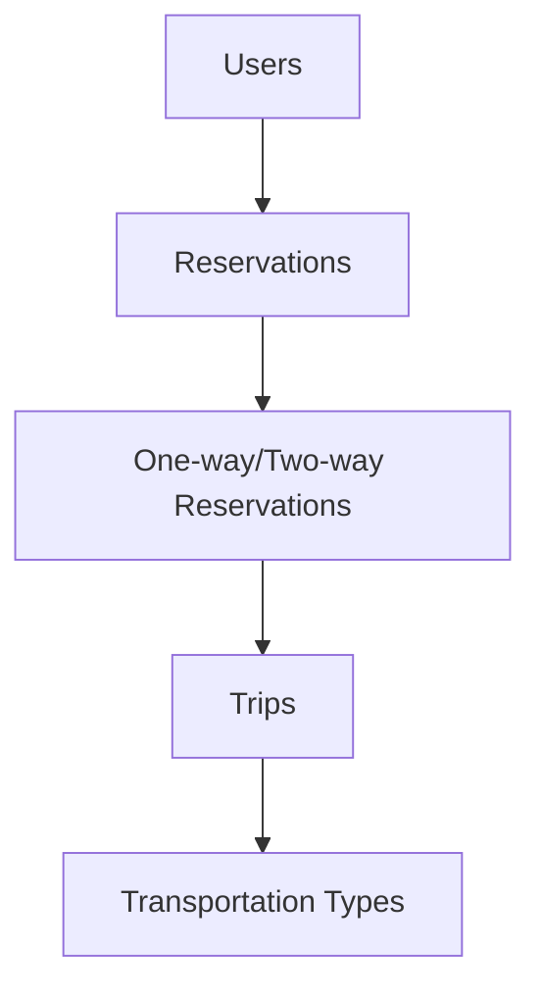

# AbuSafar Transportation System - Technical Documentation 📑

> *A comprehensive documentation of database design decisions and implementation details*


## Table of Contents 📚

1. [Introduction](#introduction)
2. [Database Design Decisions](#database-design-decisions)
3. [Schema Implementation](#schema-implementation)
4. [Data Integrity & Constraints](#data-integrity--constraints)
5. [Performance Optimization](#performance-optimization)
6. [Security Measures](#security-measures)
7. [Design Patterns & Best Practices](#design-patterns--best-practices)

---

## Introduction 🎯

This document outlines the technical decisions and implementation details of the AbuSafar Transportation System's database architecture. The system is designed to handle complex transportation booking scenarios while maintaining data integrity, performance, and scalability.

## Database Design Decisions 🏗️

### Choice of PostgreSQL
- **Why PostgreSQL?**
  - Strong support for complex data types
  - Robust transaction management
  - Advanced indexing capabilities
  - Built-in support for ENUM types
  - Excellent community support and documentation

### Normalization Strategy
- **Implementation of 3NF**
  - Eliminated transitive dependencies
  - Reduced data redundancy
  - Improved data consistency
  - Example: Separation of `location_details` from `trips` table

### Table Structure Decisions

#### User Management
```sql
users
├── Basic Info (first_name, last_name)
├── Authentication (hashed_password)
└── Profile Data (profile_picture)

user_contact
├── Contact Type (EMAIL/PHONE)
└── Contact Info
```
**Rationale**: Separated contact information to allow multiple contact methods per user while maintaining data integrity.

#### Transportation System
```sql
trips
├── Base Trip Info
└── Common Attributes

[trains/buses/flights]
├── Vehicle-Specific Attributes
└── Foreign Key to trips
```
**Rationale**: Used inheritance-like structure to separate common and specific attributes while maintaining relationships.

## Schema Implementation 🔧

### Custom Data Types
1. **User-Related ENUMs**
   - `user_type`: Differentiates between USER and ADMIN
   - `account_status`: Tracks ACTIVE/INACTIVE states

2. **Transportation ENUMs**
   - `flight_class`: Economy/Business/First class
   - `bus_class`: VIP/Standard/Sleeper
   - `chair_count_type`: Seating configuration options

### Key Relationships


## Data Integrity & Constraints 🛡️

### Check Constraints
1. **Numeric Validations**
   ```sql
   CONSTRAINT positive_price CHECK (price >= 0)
   CONSTRAINT fill_capacity CHECK (reserved_capacity <= total_capacity)
   ```

2. **Text Pattern Matching**
   ```sql
   CONSTRAINT valid_email CHECK (contact_info ~* '^[A-Za-z0-9._%+-]+@[A-Za-z0-9.-]+\.[A-Za-z]{2,}$')
   CONSTRAINT valid_phone CHECK (contact_info ~ '^\+?[1-9][0-9\s().-]{7,20}$')
   ```

### Foreign Key Relationships
- Implemented with `ON DELETE` actions
- Used `DEFERRABLE` constraints where necessary
- Cascade deletions for dependent records

## Performance Optimization ⚡

### Indexing Strategy
1. **Search Optimization**
   ```sql
   CREATE INDEX idx_users_name ON users (first_name, last_name);
   CREATE INDEX idx_location_details_city ON location_details(city);
   ```

2. **Join Optimization**
   ```sql
   CREATE INDEX idx_trips_origin_destination_location 
   ON trips(origin_location_id, destination_location_id);
   ```

### Query Performance
- Created view `ordered_trips` for common query patterns
- Implemented composite indexes for frequently joined columns
- Used partial indexes where appropriate

## Security Measures 🔒

### Data Protection
1. **Password Security**
   - Increased password field length to 255 for proper hashing
   - Implemented password complexity constraints

2. **Access Control**
   - Role-based access control via `user_type`
   - Session management through `account_status`

## Design Patterns & Best Practices 📋

### Naming Conventions
- Used clear, descriptive names
- Followed PostgreSQL's recommended naming patterns
- Consistent use of singular table names

### Code Organization
- Logical grouping of related tables
- Consistent constraint naming
- Clear separation of concerns

### Scalability Considerations
- Implemented proper indexing
- Used appropriate data types
- Designed for future expansion

---

## Appendix 📎

### Database Statistics
- Total Tables: 13
- Custom ENUM Types: 8
- Indexes: 15
- Constraints: 25+

### Entity Relationship Summary
```
Users (1) --- (N) Reservations
Trips (1) --- (1) Transportation Type
Reservations (1) --- (1) Payment
```

---

*This documentation is maintained by the AbuSafar development team and is subject to updates as the system evolves.* 